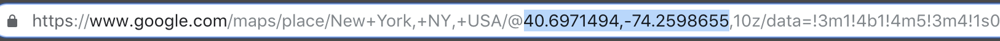
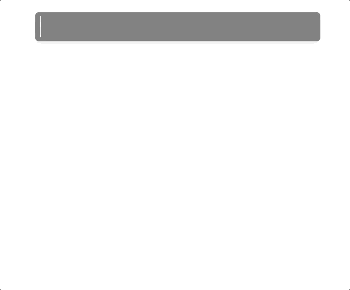
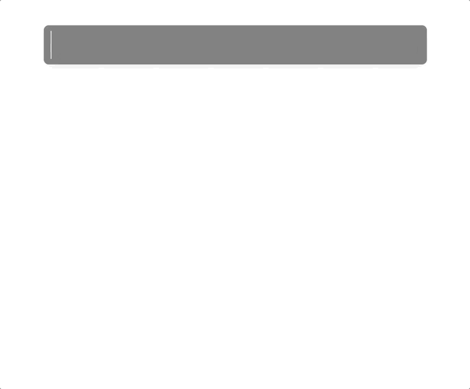

# Overview

Clima is a simple workflow for Alfred designed to give you the current weather conditions and 7 day forecast directly in Alfred. It solves a problem I personally have with have use alfred to load a website just to get the weather forecast.

There are a few options for Clima.

1. Store a default location and use the keyword without an argument
2. Search for a location by name (Valencia, Spain)
3. Search for a location by coordinates (xxxx, -yyyy)

[Here's more details on using Clima](#usage)

# Requirements

## DarkSky API Key

Clima is powered by the awesome DarkSky API. DarkSky provide a free plan with a 1000 calls a day. You will need your own DarkSky API Key to power Clima. 

* You can register for a DarkSky Account [here](https://darksky.net/dev/register)
* You can access or reset your key [here](https://darksky.net/dev/account

[Details on adding a DarkSky API key to your Clima configuration](#setup)

## Google Maps API Key

Technically you can use Clima without a Google Maps API (Geocoding API). If you either search by coordinates or store your default location by coordinates, you can avoid Goolge Maps API. However, if you want to get the most from Clima, I recommend adding a Google Maps API Key to your Clima configuration. Clima uses the Geocoding API to support searching by location name and also to display the location name when coordinates have been provided.

* You can signup for a free Google Cloud account [here](https://cloud.google.com/)
* You can access your Google Maps API Key [here](https://console.cloud.google.com/google/maps-apis/apis/geocoding-backend.googleapis.com/credentials?project=clima-1537246930306&duration=PT1H)

[Details on adding a Google Maps API key to your Clima configuration](#setup)

# Setup

There is one requred task to complete for Clima to work (adding the DarkSky API key) and two option tasks (adding Google Maps API key and setting a default location).

## Adding a DarkSky API key

Once you have created your DarkSky account and have copied your API key you need to add it to the Clima configuration. 

By default the keyword for adding DarkSky key is `w:darkskyapikey`. 

* Type `w:darkskyapikey` into Alfred 
* Paste your API key (or type it if you're a sadist)
* Hit enter and BOOOM! you should have Clima ready to rock and roll.

## Adding a Google Maps API key

Similar to adding a DarkSky API key, you can copy and paste your key from Google use the keyword `w:googlemapsapikey`.

* Type `w:googlemapsapikey` into Alfred
* Paste your API key (sadists, you know what to do)
* Hit enter and Bob's your uncle, Google now tracks your weather needs!

## Setting a default location

If you've added a Google Maps API key, adding a location is simple. If you haven't the following steps will require you to use coordinates for your default location. 

* Type `w:defaultlocation` into Alfred
* As an argument provide either a location name (Los Angeles, California) or coordinates (34.0201613,-118.6919205)
* Hit enter and now you can enjoy the weather forecast at your figure tips. 
* Just type `weather` into Alfred without and argument and you'll get your default location's forecast

Note: If you want to get coordinates for a specific location, you can search for it in Google Maps and copy the coordinates from the address bar (or use an online tool, there are lots for free).

# Usage

## Default Location 

To get the weather once you've configured a default location, just type the keyword (by default `weather`) and sit back to enjoy the fruits of your labour

## Search by location

To get the weather of a specific location, you can merely type the location after the keyword. Providing you've setup Google Maps API then you'll be get all the weathery goodness

## Search by coordinates

If you don't want to setup Google Maps you can also search using coordinates (xxxxx, -yyyyy). You can grab the location coordinates from Google Maps or from a free online tool.

 

# Credits

* Powered by [Dark Sky](https://darksky.net)
* Icons by [Heeyeun](https://www.behance.net/heeyeun)
* Created on [Alfy] (https://github.com/sindresorhus/alfy)

# Created By

[Chris Nicol](chrisnicol.me)

# License

GNU GENERAL PUBLIC LICENSE
